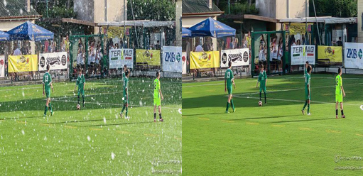

# 2025VRDL-hw4
2025 Visual Recognition using Deep Learning hw4
Student id: 313551056
Name: 王力得

## Introduction
This repository implement a rainy/snowy images restoration task with [PromptIR](https://github.com/va1shn9v/PromptIR). It may achieve 30.70 psnr on the public test data.
## Installation
This project runs on python version 3.8.11 with cuda 12.2. It is recommended to use Conda to create a virtual environment.

1. clone the repository and enter the directory by the following command (you may need to install 'git', or alternatively you may download the zip file from the github website):

```bash
git clone https://github.com/n9maple/2025VRDL-hw4.git
```

2. Create a virtual environment with Conda:

```bash
conda create -n hw3 python=3.8.11
```

3. Activate the environment and download the packages:

```bash
conda activate hw3
pip install -r requirements.txt # Make sure you are using cuda 12.2
```

## Run the code
Before running the code, please make sure you have download the dataset and the dataset are put and orginized under "data" folder like the below:
```bash
data
├── test
│   ├── 0.png
│   ├── 1.png
│   ├── 2.png
    ...
└── Train
    └── Derain
        ├── clean
            ├── rain_clean-1.png
            ├── rain_clean-2.png
            ├── rain_clean-3.png
            ...
        └── degraded
            ├── rain-1.png
            ├── rain-2.png
            ├── rain-3.png
            ...

```
1. Activate the environment

```bash
conda activate hw3
```

2. run preprocess.py and put "rainTrain.txt" under "data_dir/rainy" folder
```bash
python preprocess.py
```

3. Run the training code with the argumentation.
```bash
python train.py --de_type derain
```
except for "de_type", you don't need to add other arguments to run train.py, but you can check the arguments list by the following command:

```bash
python train.py -h
```

4. Run the inference code. Before run the inference code, you need to name it "model.ckpt" and put it in "ckpt" folder. If you don't want to train your own model, you may download the weight from the link: 
[https://drive.google.com/file/d/1P-wU7MCYpKjBbAW4XbgRnsw7MUNVUXgs/view?usp=sharing](https://drive.google.com/file/d/1P-wU7MCYpKjBbAW4XbgRnsw7MUNVUXgs/view?usp=sharing)

```bash
python demo.py
```

The prediction results will be saved in "output" folder.

5. You may run img2npz.py to convert your image to numpy file:
```bash
python img2npz.py
```

## Performance Snapshot

<figure>
  
</figure>

<figure>
  
</figure>
